# StudentAdmissionCoreDataApp
<h1>Functionality:</h1>

<ol>
    <li>Admin Login / Logout (with UserDefaults)</li>
    <li>Student Login / Logout (with UserDefaults)</li>
</ol>
<ul>
    <li>Admin can:</li>
    <ol>
        <li>Login</li>
        <li>Add new student (giving a unique spid)</li>
        <li>Fetch all students data</li>
        <li>Fetch students data from a particular class</li>
        <li>Modify existing student details</li>
        <li>Remove a student</li>
        <li>Update NoticeBoard</li>
    </ol>
    <li>Students can:</li>
    <ol>
        <li>Login ( default id password will be his/her spid )</li>
        <li>View his/her details</li>
        <li>Change password</li>
        <li>Read NoticeBoard</li>
    </ol>
</ul>
<h1>Screenshots</h1>

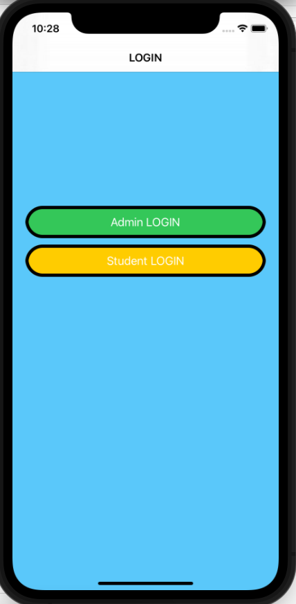
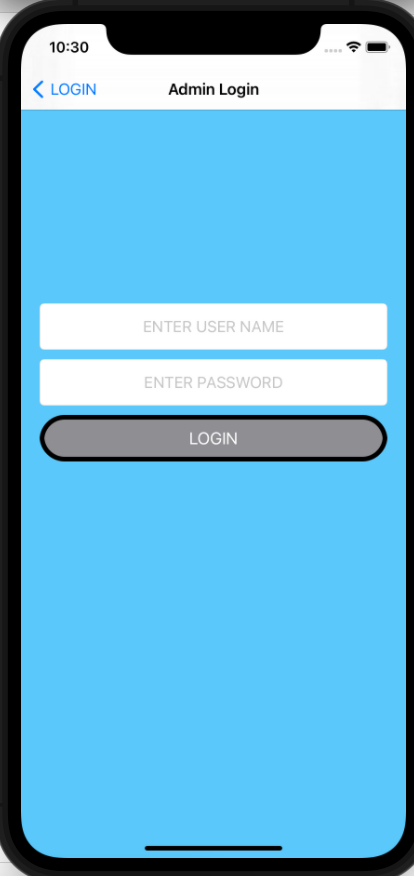
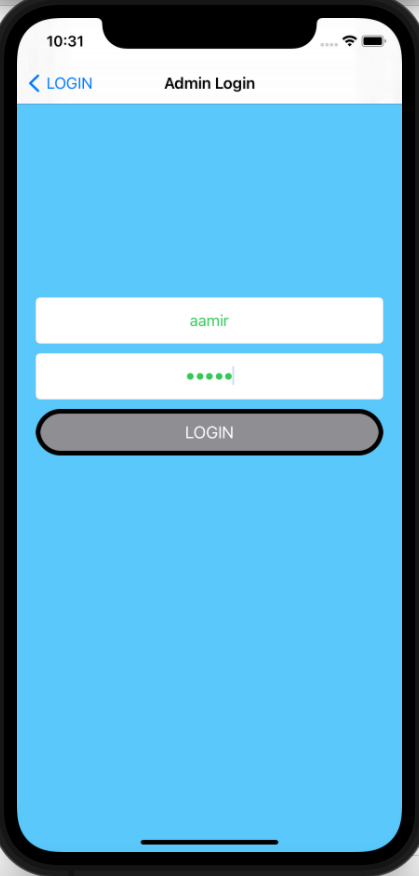
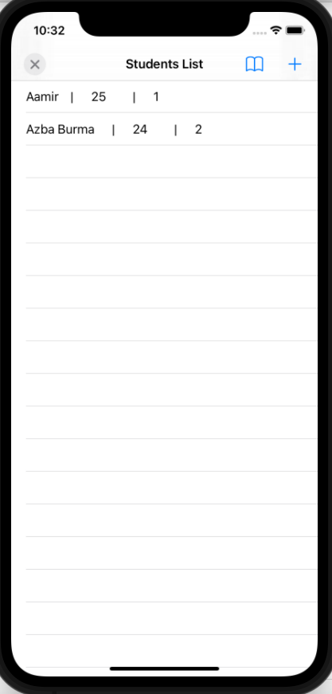
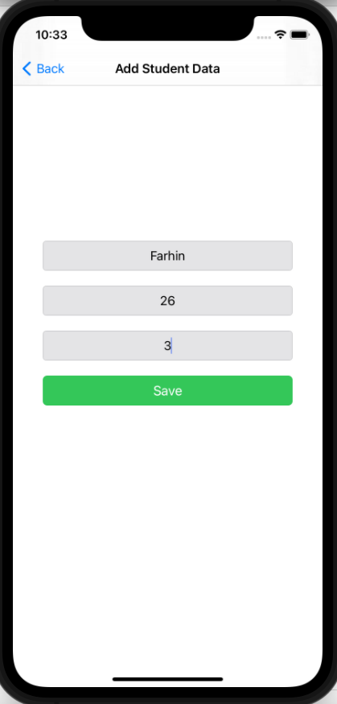
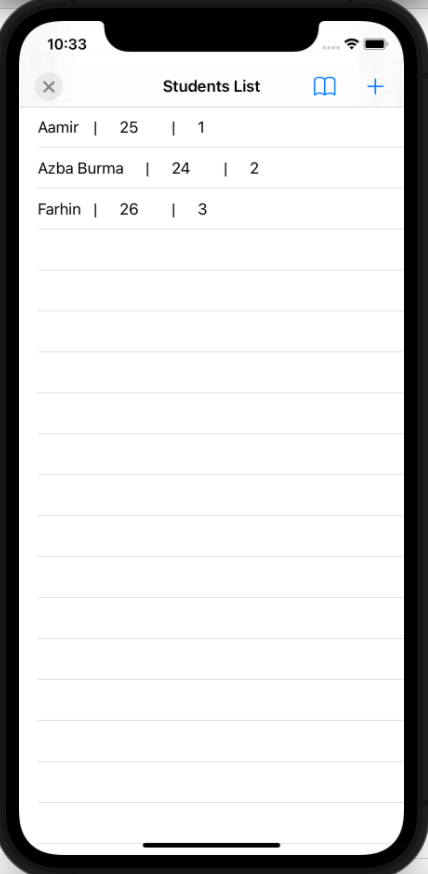
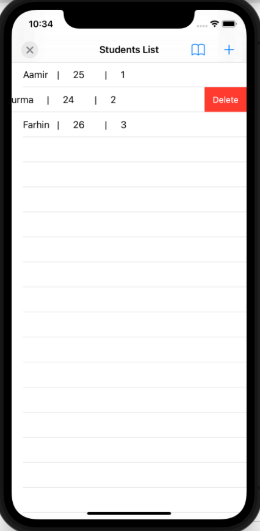
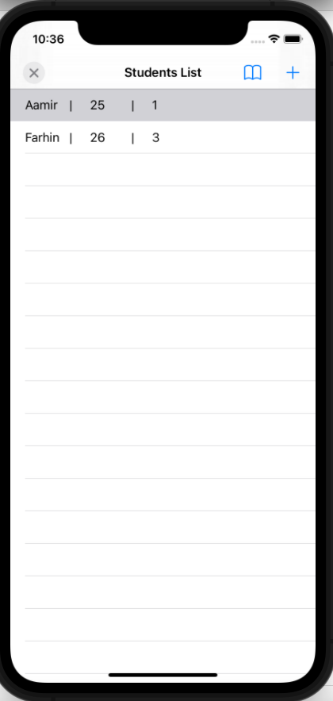
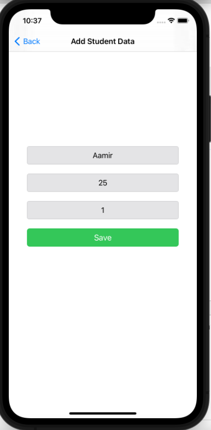
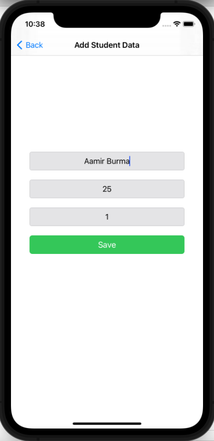
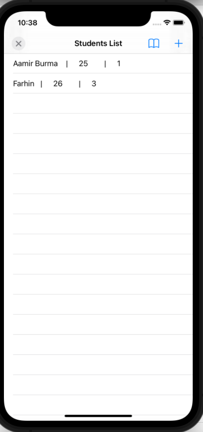
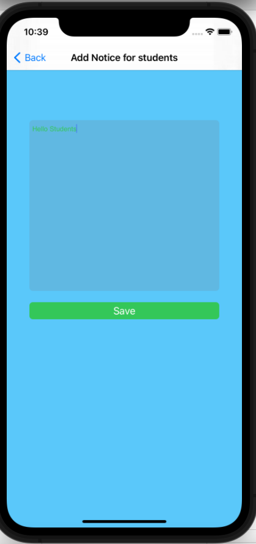
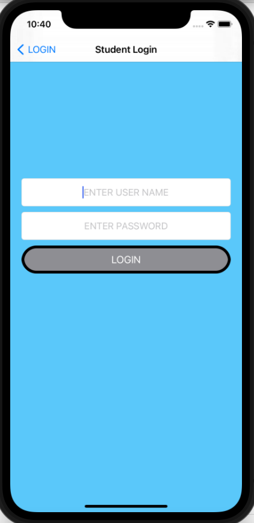
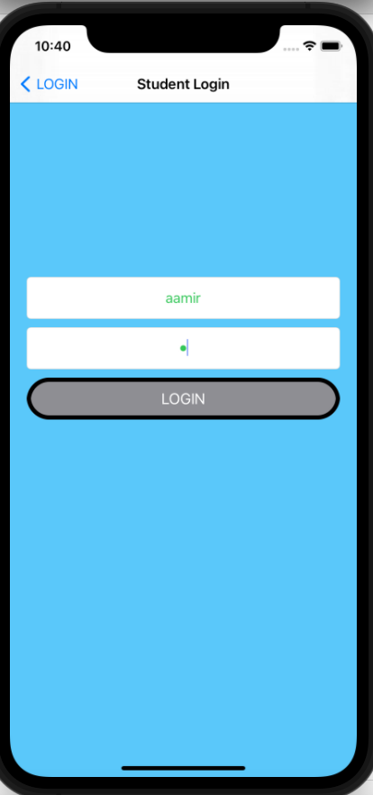
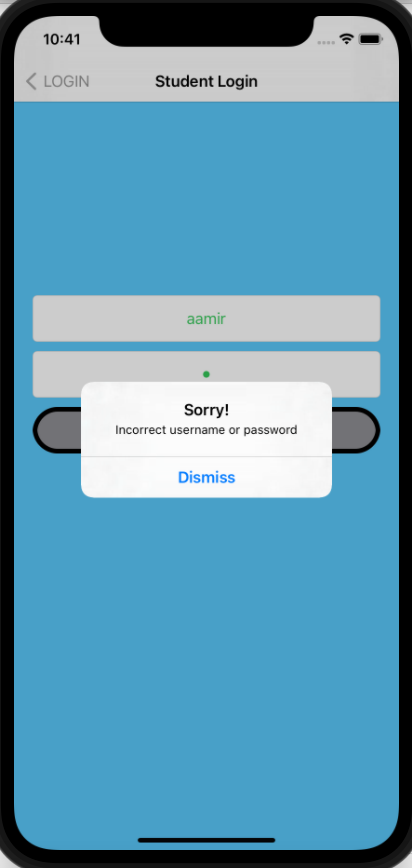
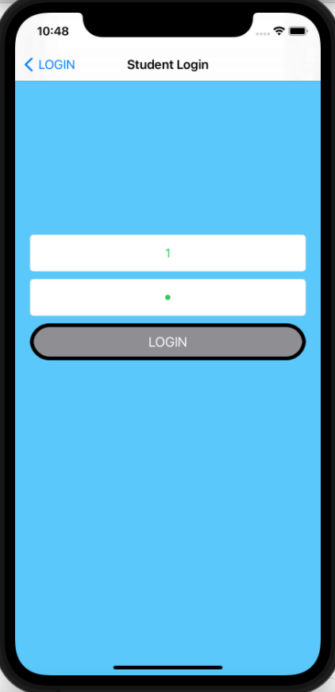
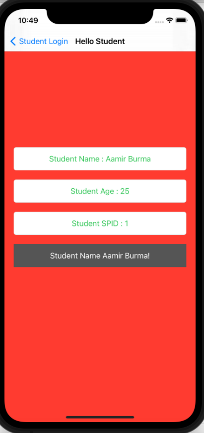